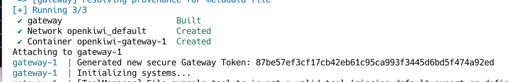
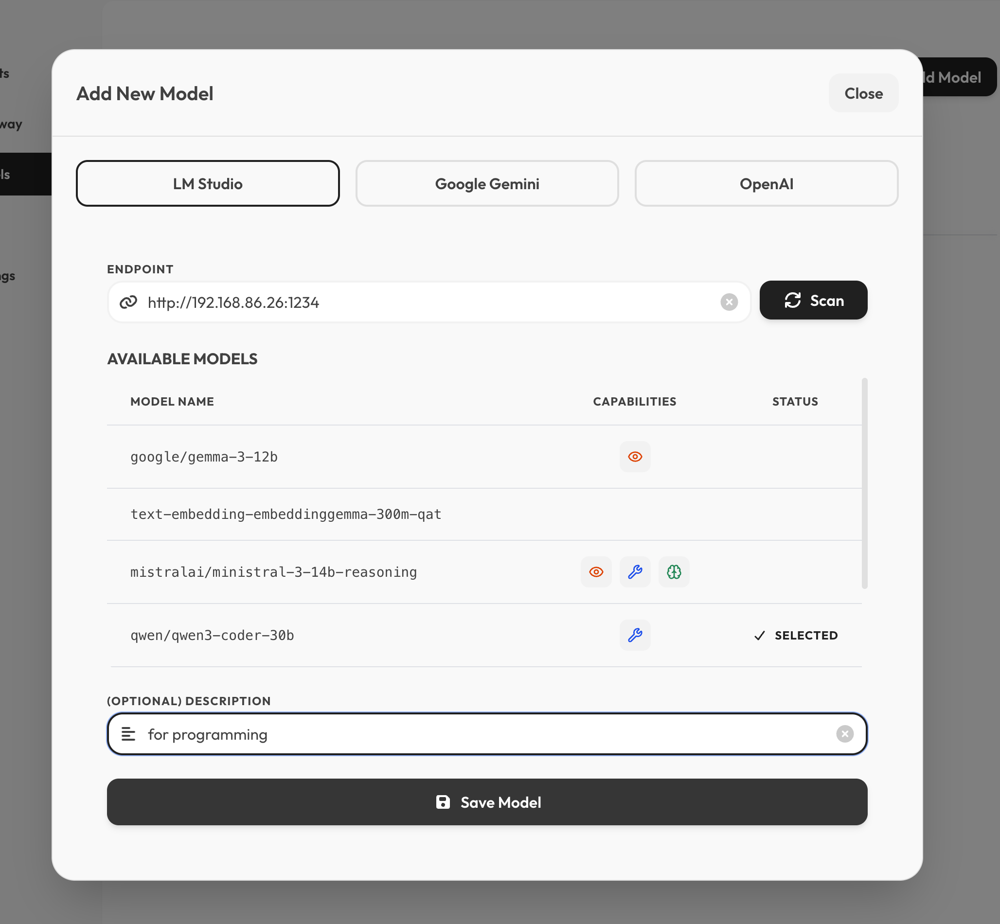
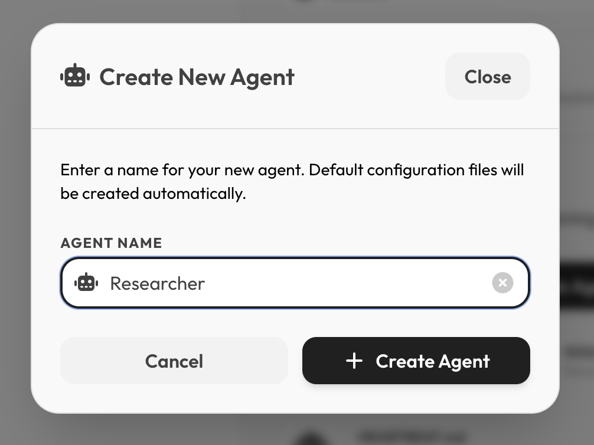
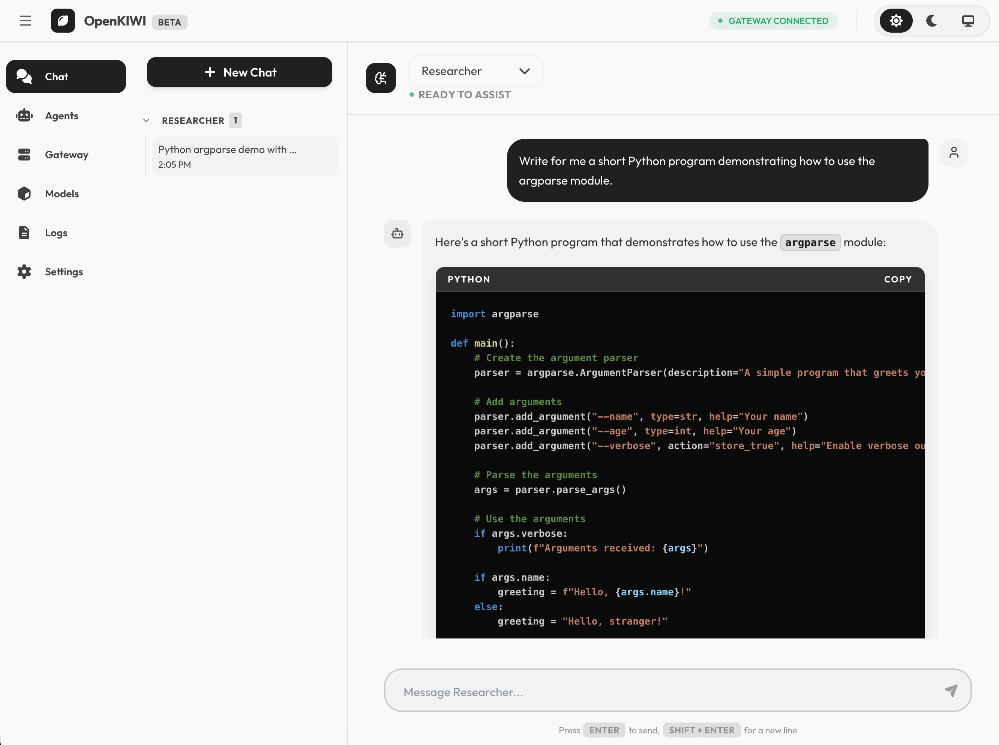

# OpenKIWI

### 🚀 Quickstart

#### 1. Launch the Services
```
docker compose up --build
```

#### 2. Connect to the gateway

* Copy the gateway token from the logs:



* Go to `http://localhost:3000`
* Click on Gateway
* Paste the token

You should now see `GATEWAY CONNECTED` at the top of the page.

#### 3. Setup your first model


#### 4. Setup your first agent


#### 5. Start chatting
