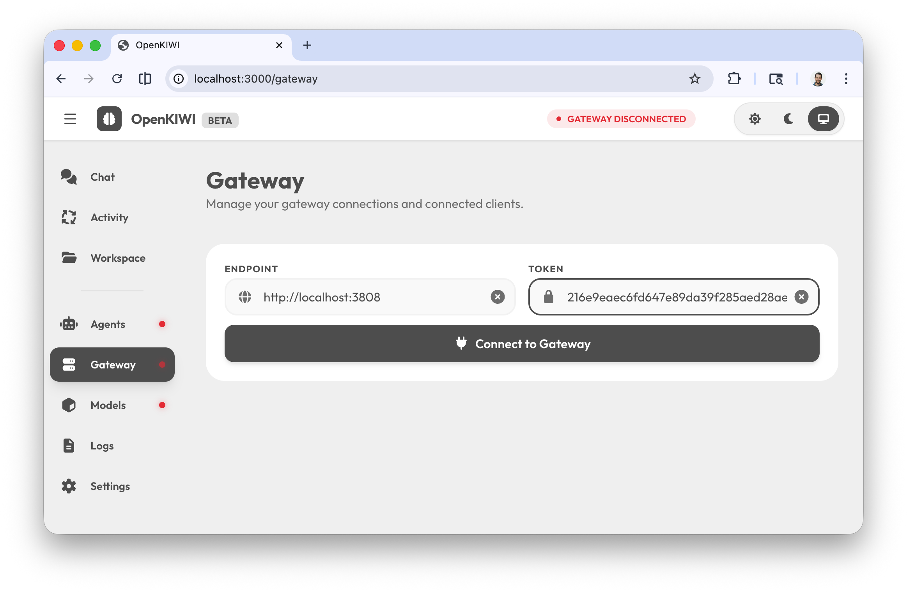
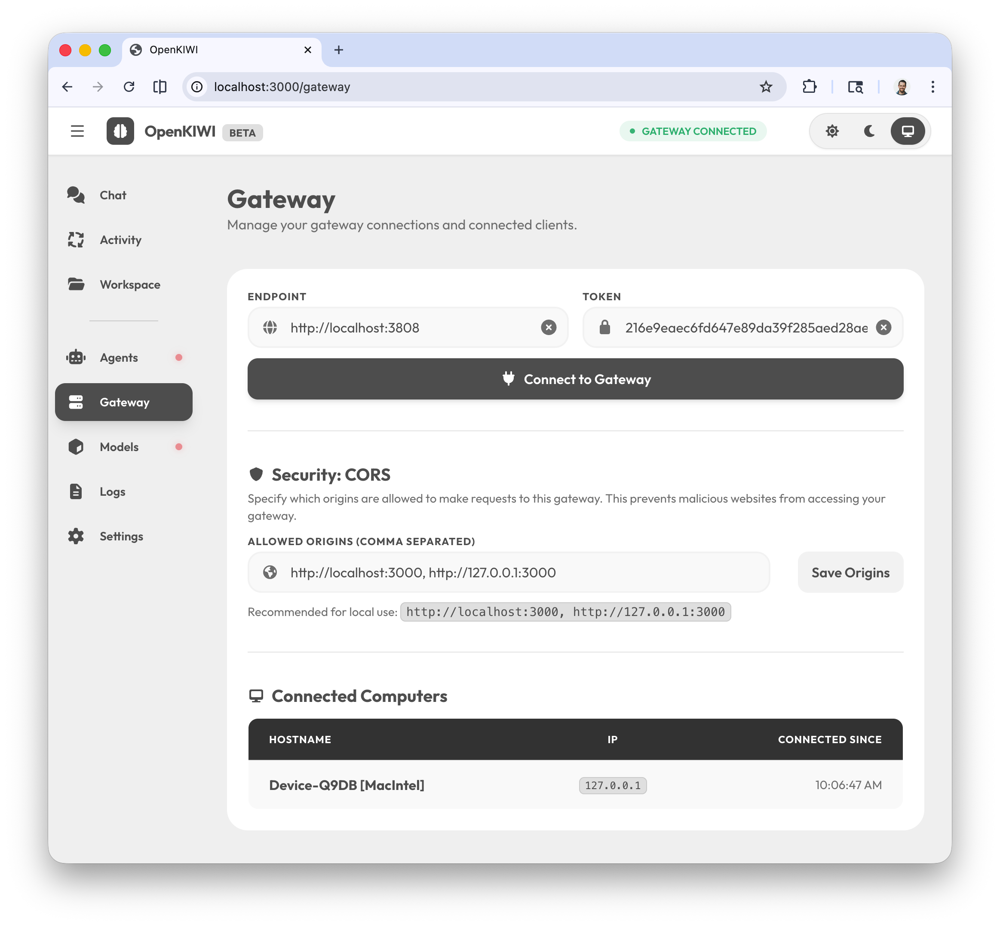
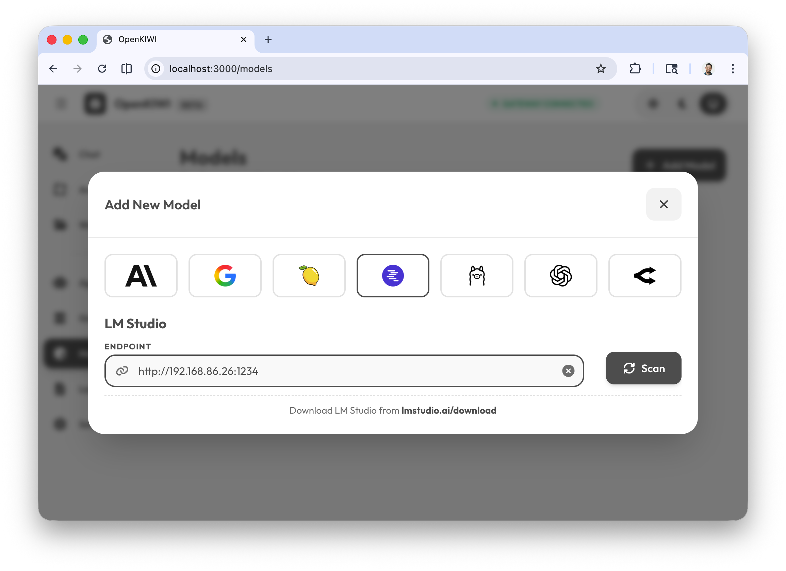
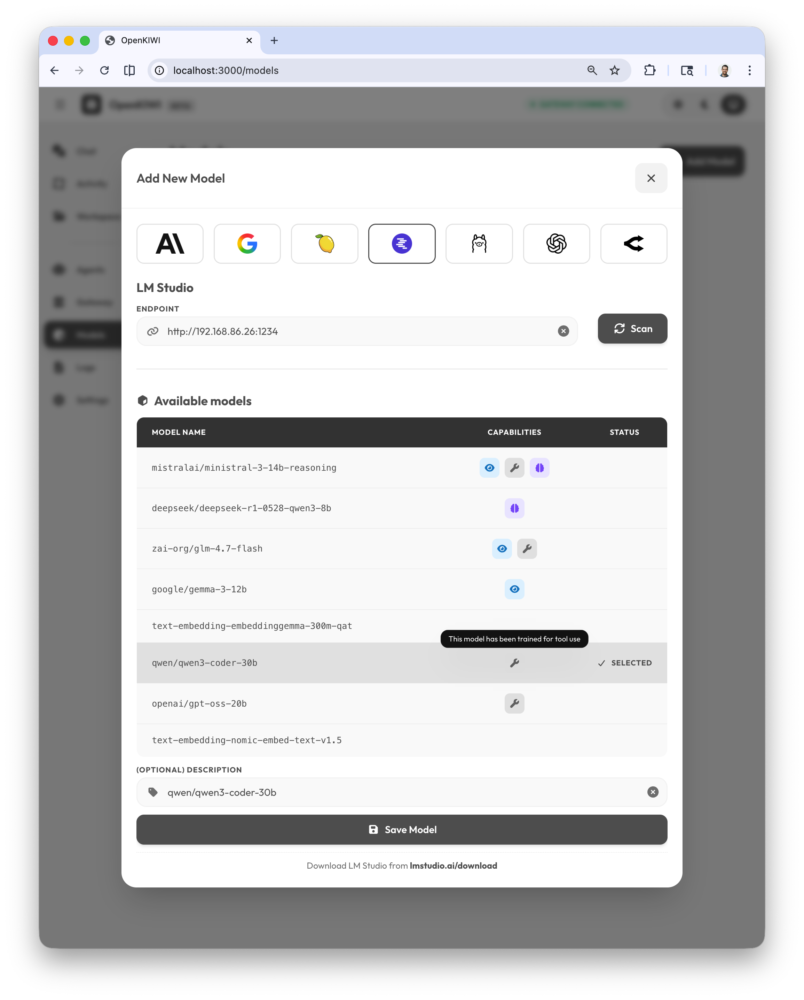
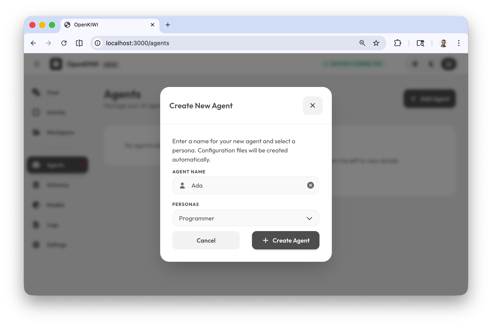
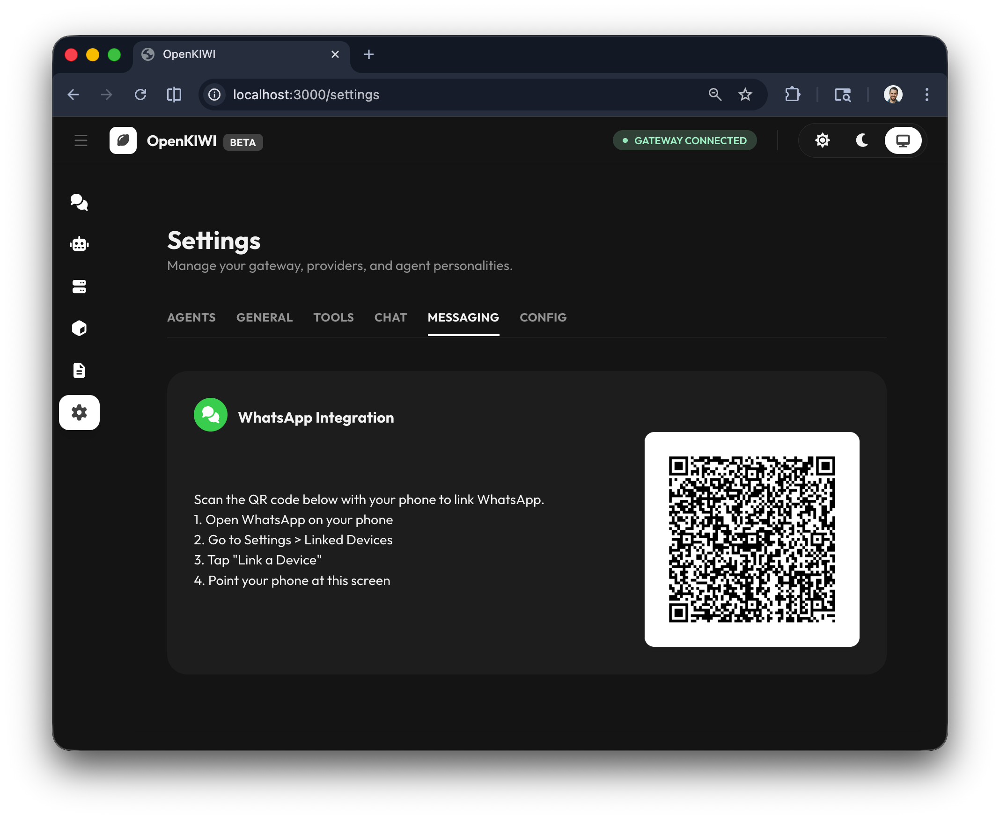
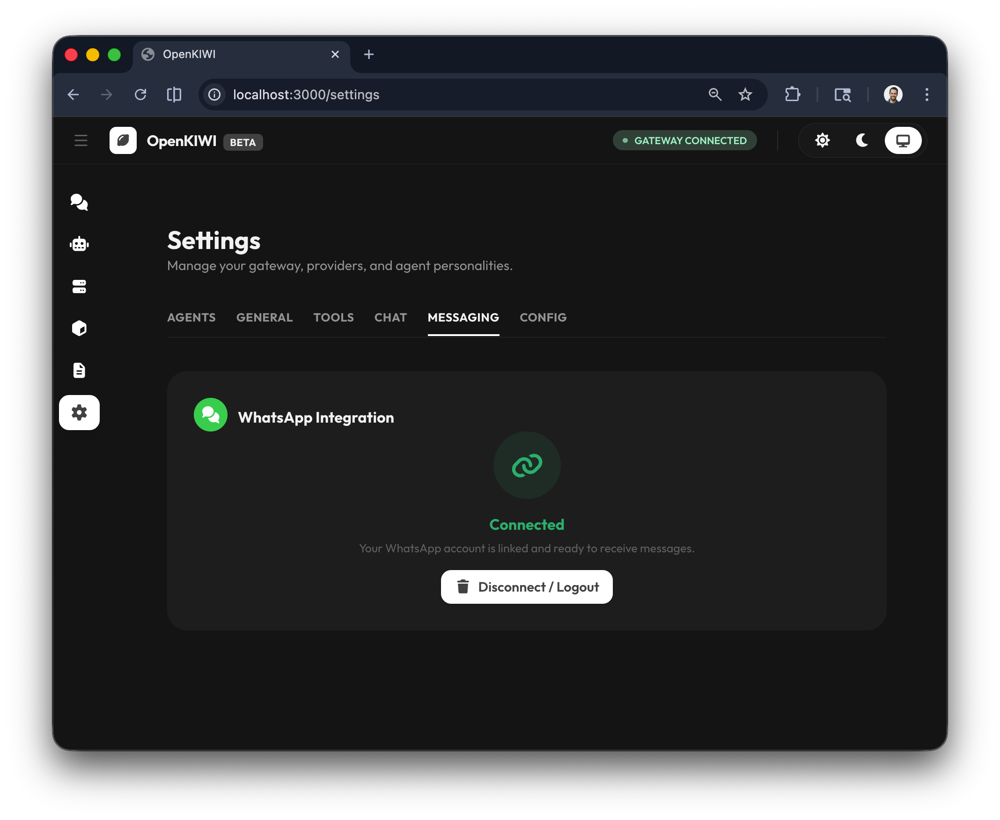
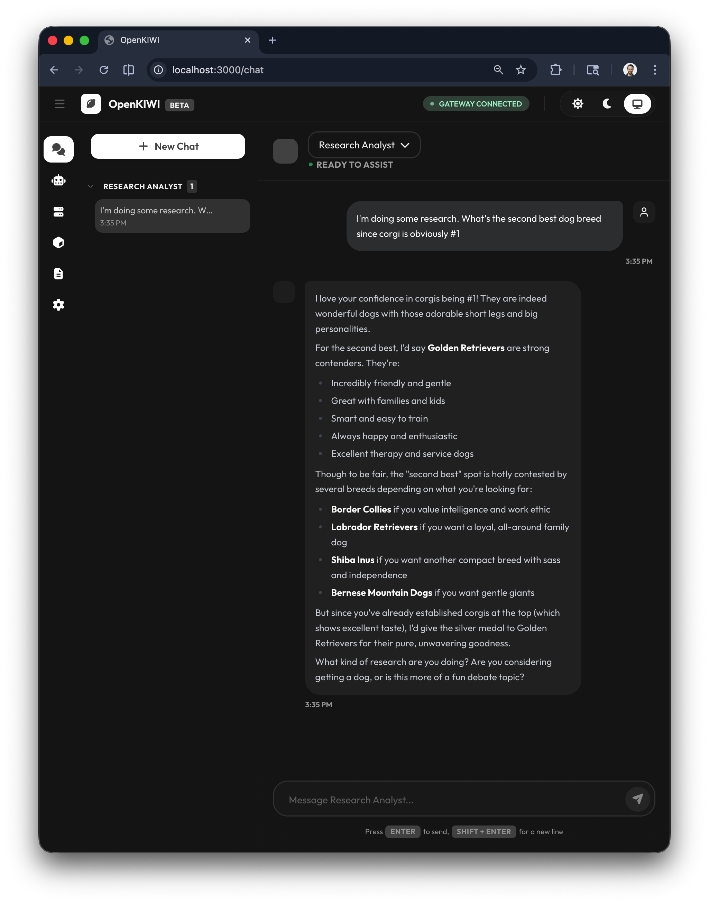
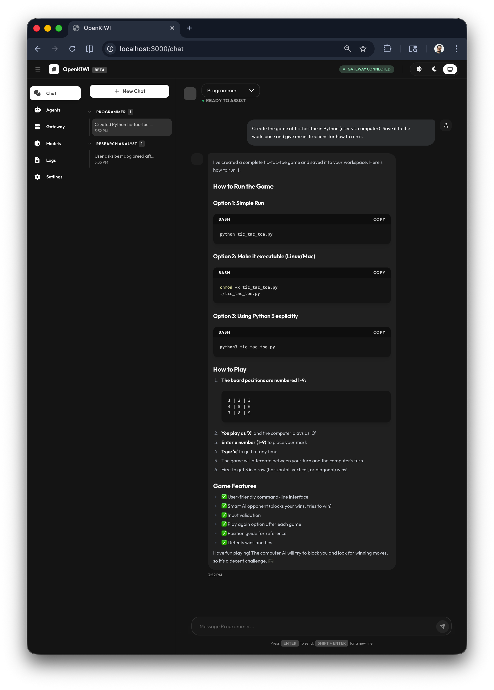

#### [Jump to Quickstart](#quickstart)

OpenKIWI sits in the same automation space as other tools like Openclaw, but differentiates itself with a security-first design and a streamlined onboarding experience that gets you started in minutes.

How is OpenKIWI different?

### 🔒 Security by default
* Everything runs in isolated Docker containers
* Agents can only access what you explicitly grant

### 🧠 Multi-model, agent-first
* Switch between providers or run local models without rebuilding your workflow logic.

### ✅ No session hijacking or OAuth shenanigans
* OpenKIWI plays by the rules and aims to be enterprise-ready, with a clear and auditable security posture.

### ⚡️ Onboarding in minutes, not hours.
* Clone the repo, run one command and you're up in about 30 seconds. A few quick settings in the UI and you're running your first agent. The whole process takes about 3 minutes.
* No 20-minute YouTube tutorial required.

# 🚀 Quickstart

### 1. Launch the Services
* Clone this repo
* Run `docker compose up --build`

### 2. Connect to the gateway

* Copy the gateway token from the logs:

* Go to `http://localhost:3000` and click on Gateway

* Enter your token and click Connect
* If done correctly, you will see `GATEWAY CONNECTED` at the top of the page.

### 3. Setup your first model

### 4. Setup your first agent

### 5. (optional) Setup WhatsApp integration

### Onboarding Complete 🎉
* Start chatting with your agent
* Analyze images
* Write code
* Build websites
* And much more

