[](https://github.com/chrispyers/openkiwi/actions/workflows/test.yml)

#### [Jump to Quickstart](#quickstart)

## What is it?
OpenKIWI sits in the same automation space as other tools like Openclaw, but differentiates itself with a security-first design and a streamlined onboarding experience that gets you started in minutes.

How is OpenKIWI different?

#### Security by default
* Everything runs in isolated Docker containers
* Agents can only access what you explicitly grant

#### Multi-model, agent-first
* Switch between providers or run local models without rebuilding your workflow logic.

#### No session hijacking or OAuth shenanigans
* OpenKIWI plays by the rules and aims to be enterprise-ready, with a clear and auditable security posture.

#### Onboarding in minutes, not hours.
* Clone the repo, run one command and you're up in about 30 seconds. A few quick settings in the UI and you're running your first agent. The whole process takes about 3 minutes.
* No 20-minute YouTube tutorial required.


<a id="quickstart"></a>
## Quickstart

### 1. Launch the Services
* Clone this repo
* `cd` to the directory where you cloned the repo
    * You should see a `docker-compose.yml` file in this directory
* Run `docker compose up --build`

### 2. Connect to the gateway

* Copy the gateway token from the logs:

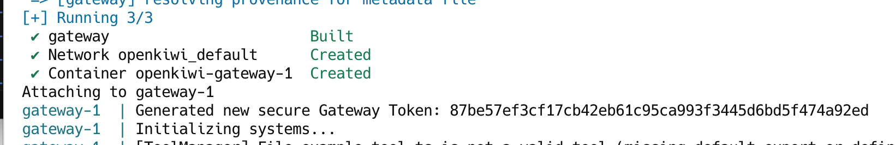

* Go to `http://localhost:3000` and click on Gateway

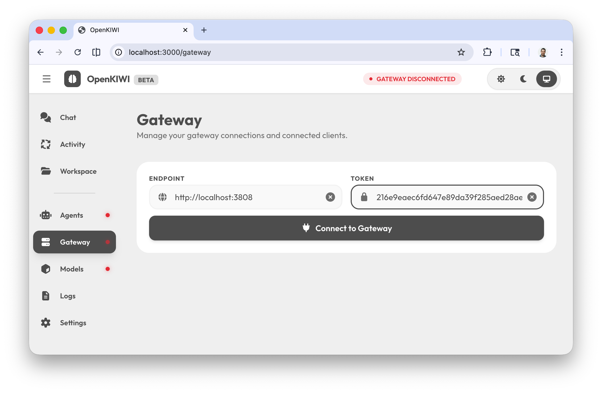

* Enter your token and click Connect
* If done correctly, you will see `GATEWAY CONNECTED` at the top of the page.

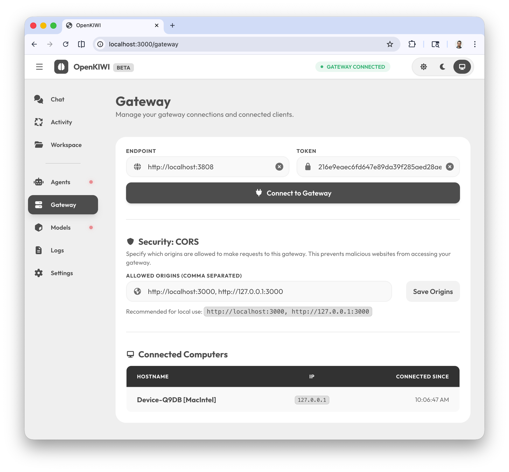


### 3. Setup your first model
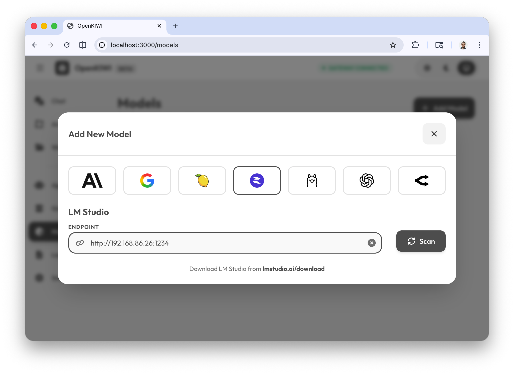
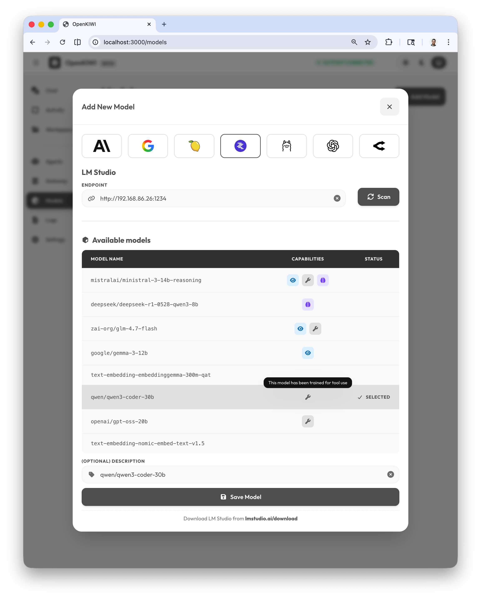

### 4. Setup your first agent
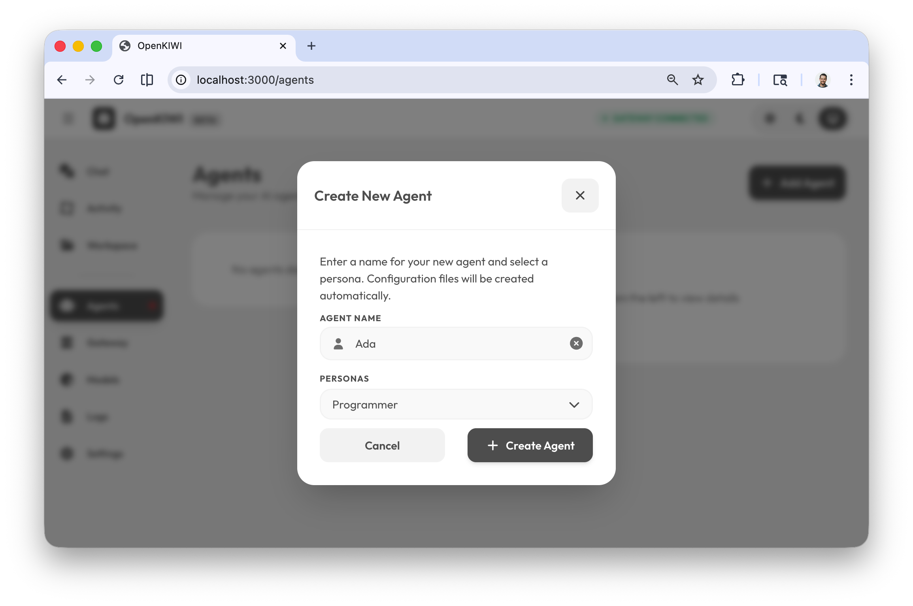

### 5. (optional) Setup WhatsApp integration

Connect WhatsApp so you can message your agents from your phone.

#### Pairing

1. Go to the Settings page and click the WhatsApp tab
2. Scan the QR code with your phone (WhatsApp > Linked Devices > Link a Device)
3. Once paired, the status will show as connected

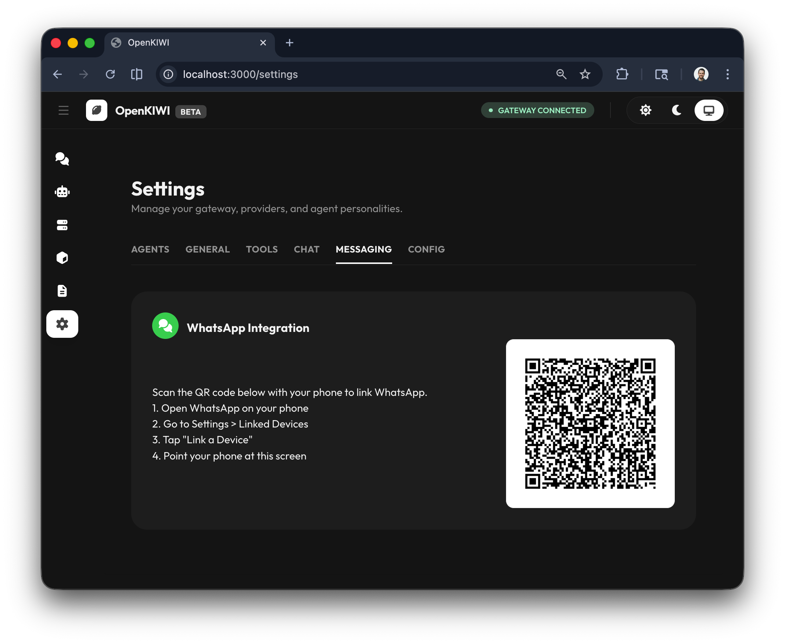
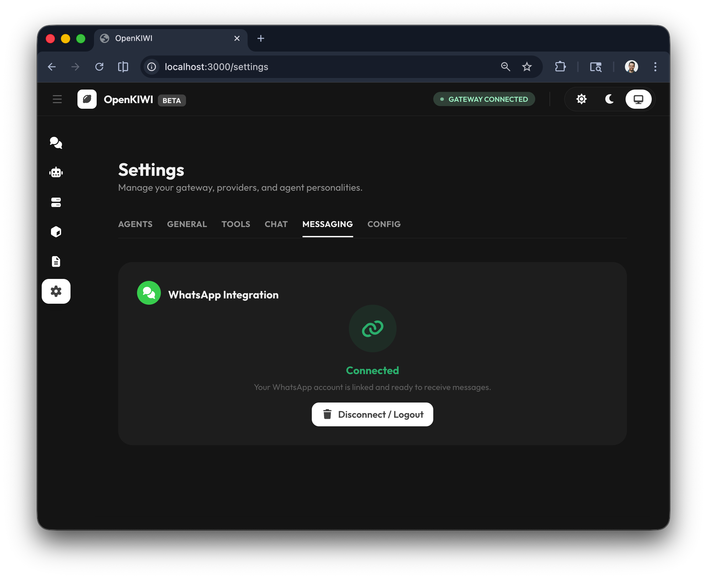

Start messaging agents from your phone:

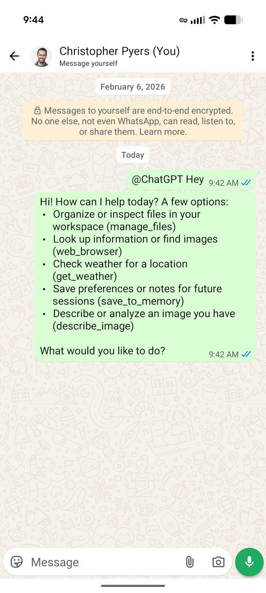

#### (Recommended) Restrict access

By default, any WhatsApp number that messages the linked account can interact with agents. Add an allowlist to restrict access:

```
WHATSAPP_ALLOW_LIST=447958673279, 1234567890
```

Accepts comma-separated phone numbers (digits only, no `+` prefix required). Numbers not on the list are silently ignored. LID-based JIDs (used by some WhatsApp versions) are automatically resolved to phone numbers for matching.

#### Heartbeat delivery

Agents can send scheduled heartbeat messages to WhatsApp. Add a channel to the agent's `config.json`:

```json
{
  "heartbeat": {
    "enabled": true,
    "schedule": "0 9 * * 1",
    "channels": [
      { "type": "whatsapp", "jid": "447958673279@s.whatsapp.net" }
    ]
  }
}
```

The `jid` is the recipient's phone number followed by `@s.whatsapp.net`. WhatsApp must be connected for delivery to work — if disconnected, the channel is skipped and a warning is logged.

### 6. (optional) Setup Telegram integration

Connect a Telegram bot so you can message your agents from Telegram.

#### Create a bot

1. Open Telegram and message [@BotFather](https://t.me/BotFather)
2. Send `/newbot` and follow the prompts to name your bot
3. Copy the **bot token** BotFather gives you

#### Configure environment

Add to your `.env` file:

```
TELEGRAM_BOT_TOKEN=your_bot_token_here
```

#### (Recommended) Restrict access

By default, anyone who finds your bot can message it. Add an allowlist to restrict access to specific users:

```
TELEGRAM_ALLOW_LIST=123456789, @yourusername
```

Accepts comma-separated Telegram user IDs and/or `@usernames`. To find your user ID, message [@userinfobot](https://t.me/userinfobot) on Telegram.

#### Messaging agents

- Send any message to your bot — it goes to the default agent
- Mention a specific agent by name: `@Oracle what happened this week?`
- Use `/agents` to list all available agents

#### Heartbeat delivery

Agents can send scheduled heartbeat messages to Telegram. Add a channel to the agent's `config.json`:

```json
{
  "heartbeat": {
    "enabled": true,
    "schedule": "0 16 * * 5",
    "channels": [
      { "type": "telegram", "chatId": "123456789" }
    ]
  }
}
```

The `chatId` is the Telegram chat where messages will be delivered (usually your user ID).

### 7. (optional) Enable tools

OpenKIWI ships with several built-in tools that extend your agents' capabilities. Enable them in the Settings page:

| Tool | Description | Docs |
|------|-------------|------|
| Filesystem | Read/write workspace files | Built-in |
| Vision | Analyse images | Built-in |
| Web Browser | Browse and extract web content | Built-in |
| GitHub | Read/write files in GitHub repos | [tools/github/](tools/github/README.md) |
| Google Tasks | Manage Google Tasks lists and items | [tools/google_tasks/](tools/google_tasks/README.md) |
| Qdrant | Semantic search across vector stores | [tools/qdrant/](tools/qdrant/README.md) |

See [tools/README.md](tools/README.md) for the full list and how to create your own.

## Heartbeats

Heartbeats let agents run autonomously on a schedule — no user prompt required. Each heartbeat reads the agent's `HEARTBEAT.md` file, executes the instructions via the LLM (with full tool access), and delivers the response to configured channels.

### How it works

1. The Heartbeat Manager reads each agent's `config.json` at startup
2. Agents with `heartbeat.enabled: true` are scheduled using their cron expression
3. When the cron fires, the agent's `HEARTBEAT.md` is loaded as the prompt
4. The agent runs a full agent loop (including tool calls) and produces a response
5. The response is delivered to all configured channels
6. A session is saved so the conversation history is preserved

### Configuration

In the agent's `config.json`:

```json
{
  "name": "Oracle (Analyst)",
  "emoji": "📊",
  "provider": "qwen3-30b-a3b-thinking-2507-mlx",
  "heartbeat": {
    "enabled": true,
    "schedule": "0 16 * * 5",
    "channels": [
      { "type": "telegram", "chatId": "123456789" },
      { "type": "whatsapp", "jid": "123456789@s.whatsapp.net" },
      { "type": "websocket" }
    ]
  }
}
```

### Schedule format

Uses standard [cron syntax](https://crontab.guru/) (5 fields: minute, hour, day-of-month, month, day-of-week):

| Example | Meaning |
|---------|---------|
| `0 9 * * *` | Every day at 09:00 |
| `0 16 * * 5` | Every Friday at 16:00 |
| `0 23,1,3,5,7 * * *` | Every 2 hours overnight (23:00-07:00) |
| `15 8,17 * * *` | Twice daily at 08:15 and 17:15 |
| `0 9 * * 1` | Every Monday at 09:00 |

### Delivery channels

| Channel | Config | Description |
|---------|--------|-------------|
| **Telegram** | `{ "type": "telegram", "chatId": "123456789" }` | Sends message to a Telegram chat. Requires `TELEGRAM_BOT_TOKEN` in `.env`. |
| **WhatsApp** | `{ "type": "whatsapp", "jid": "123456789@s.whatsapp.net" }` | Sends message via WhatsApp. Requires WhatsApp integration to be connected. |
| **WebSocket** | `{ "type": "websocket" }` | Broadcasts to all connected UI clients in real time. |

Multiple channels can be configured — the response is delivered to all of them. If one channel fails (e.g. Telegram disconnected), the others still receive the message.

### Writing HEARTBEAT.md

The `HEARTBEAT.md` file in the agent's directory contains the instructions the agent will execute on each heartbeat. Write it as you would a user prompt:

```markdown
# Weekly Summary

Review what happened this week and produce a summary.

## What to Do
1. Check Google Tasks for completed and overdue items
2. Review GitHub activity across the repos
3. Identify wins and misses
4. Suggest adjustments for next week
5. End with a 3-5 bullet executive summary

Always sign off with your name and emoji.
```

The agent has full access to its configured tools during heartbeat execution, so it can call GitHub, Google Tasks, Qdrant, or any other enabled tool.

### Behaviour notes

- Heartbeats won't overlap — if a previous execution is still running, the next trigger is skipped
- Thinking/reasoning tags (`<think>...</think>`) are stripped from channel messages but preserved in saved sessions
- Sessions are persisted per channel (e.g. `tg-123456789_analyst`) so conversation history accumulates over time
- The agent's state is set to "working" during execution and returns to "idle" when finished

## Security: Allowlists

OpenKIWI supports allowlists for both messaging platforms to control who can interact with your agents. Without an allowlist, anyone who can reach the bot/linked account can send messages.

### Configuration

Add to your `.env` file:

| Variable | Format | Example |
|----------|--------|---------|
| `TELEGRAM_ALLOW_LIST` | Comma-separated user IDs and/or `@usernames` | `123456789, @johndoe` |
| `WHATSAPP_ALLOW_LIST` | Comma-separated phone numbers (digits only) | `447958673279, 1234567890` |

### Behaviour

| | Telegram | WhatsApp |
|---|---------|----------|
| **Accepts** | Numeric user IDs, `@usernames` | Phone numbers (digits only) |
| **If not set** | All users allowed | All numbers allowed |
| **Blocked messages** | Silently ignored (logged) | Silently ignored (logged) |
| **LID resolution** | N/A | Automatic — LID JIDs are resolved to phone numbers for matching |

### Finding your IDs

- **Telegram user ID**: Message [@userinfobot](https://t.me/userinfobot) on Telegram
- **Telegram chat ID**: Same as user ID for direct messages; for groups, use [@getidsbot](https://t.me/getidsbot)
- **WhatsApp JID**: Your phone number in international format without the `+` prefix, followed by `@s.whatsapp.net` (e.g. `447958673279@s.whatsapp.net`)

### Onboarding Complete 🎉
* Start chatting with your agent
* Analyze images
* Write code
* Build websites
* Schedule ongoing tasks for your agents
* Import your ChatGPT history
* And much more


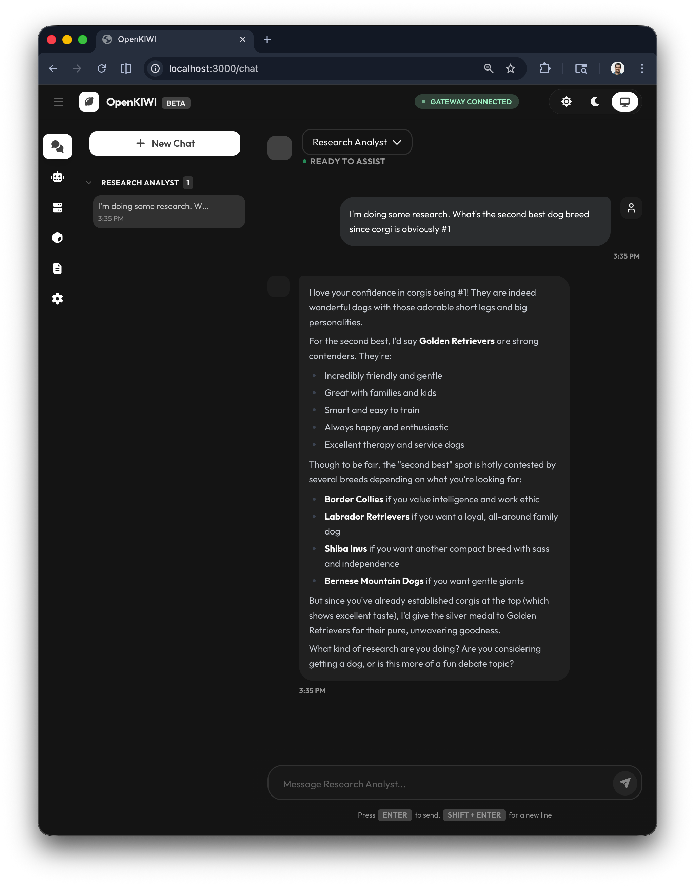
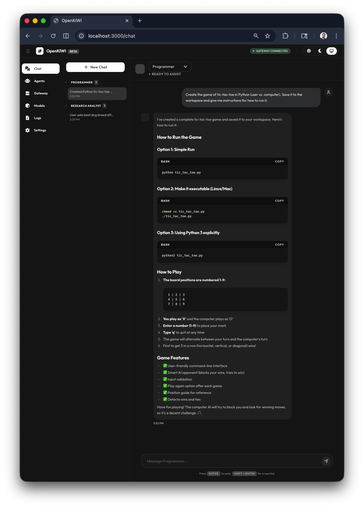